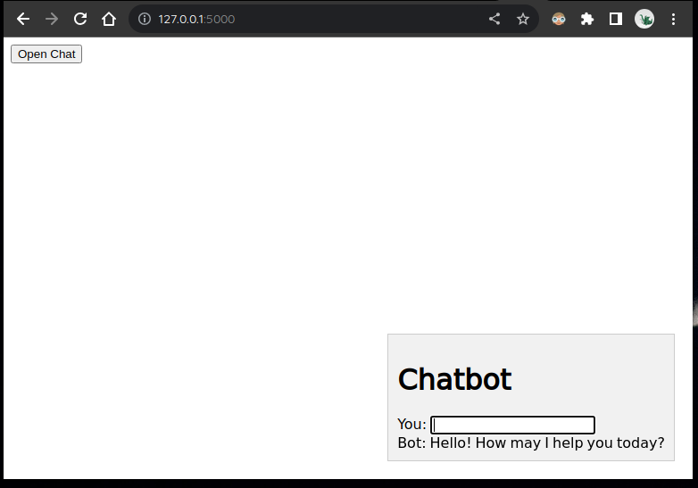
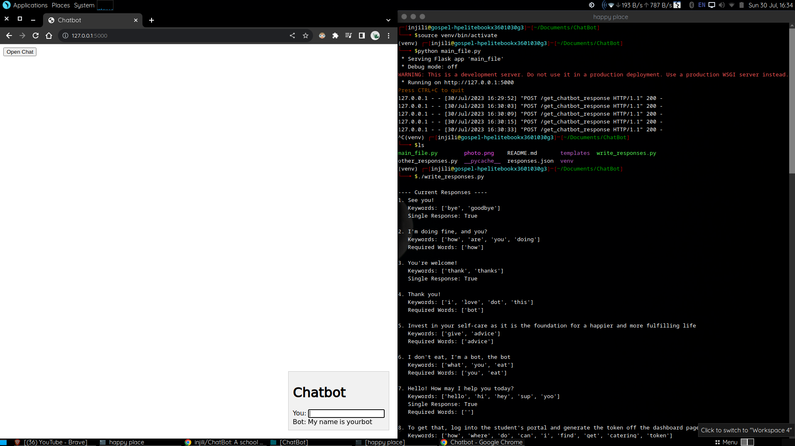

# Python ChatBot - An Interactive Chatbot Application

This Python project is an interactive chatbot that engages in a conversation with the user. The chatbot uses a simple rule-based approach to generate responses based on pre-defined keywords and responses stored in a JSON file. The chatbot provides replies based on the keywords found in the user's input and calculates the probability of suitable responses.

## Features:
The chatbot processes user input and attempts to find the most appropriate response based on pre-defined keywords.  
Responses are provided from the [responses.json](responses.json) file, allowing easy customization of the bot's behavior.  
The chatbot calculates the message probability for each response, considering the presence of recognized keywords and any required words specified for a response.  
The chatbot includes an [other_responses.py](other_responses.py) module for handling generic responses.  
The bot responds to common exit words like "bye" or "exit" to end the conversation.  
The bot's responses stored in the responses.json can be modified from the [write_responses.py](write_responses.py) file.

## Usage:
First, start the virtual environment with the command ```source venv/bin/activate```.
Run the [main_file.py](main_file.py) script to start the bot with the command ```python main_file.py```.  
Next go to your browser and type in the address http://127.0.0.1:5000  
Click the 'open chatbot' button and type your message  

The chatbot will process your input and provide appropriate responses.  
The administrator would have to run the write_responses.py file so they can modify the responses. The command is ```./write_responses.py```.

## Customization:
To customize the chatbot's behavior, you can modify the responses.json file. It contains a list of responses, each associated with specific keywords and optional required words. You can add, modify, or delete responses to personalize the chatbot's replies from the write_responses.py script.  


> Note: This chatbot uses a simple rule-based approach and may not have sophisticated natural language understanding capabilities. It serves as a starting point for building more complex conversational AI applications.

## Author
injili (nyarekigospel@gmail.com)
